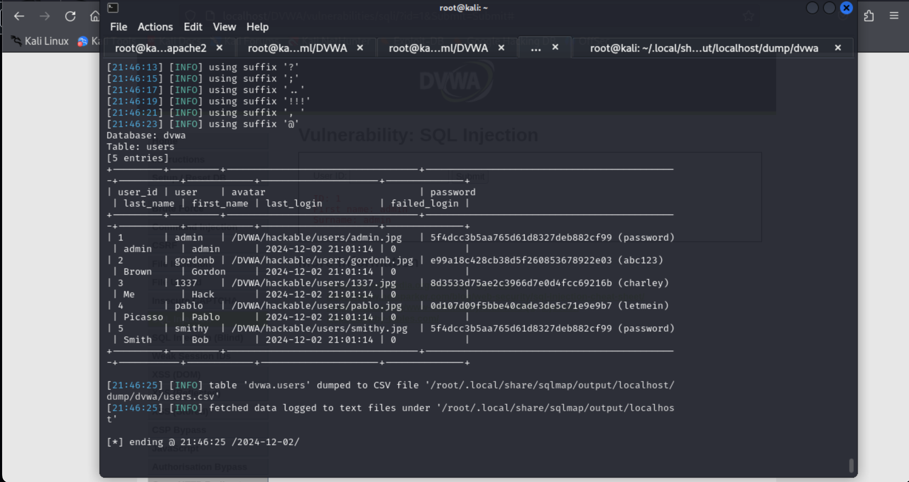
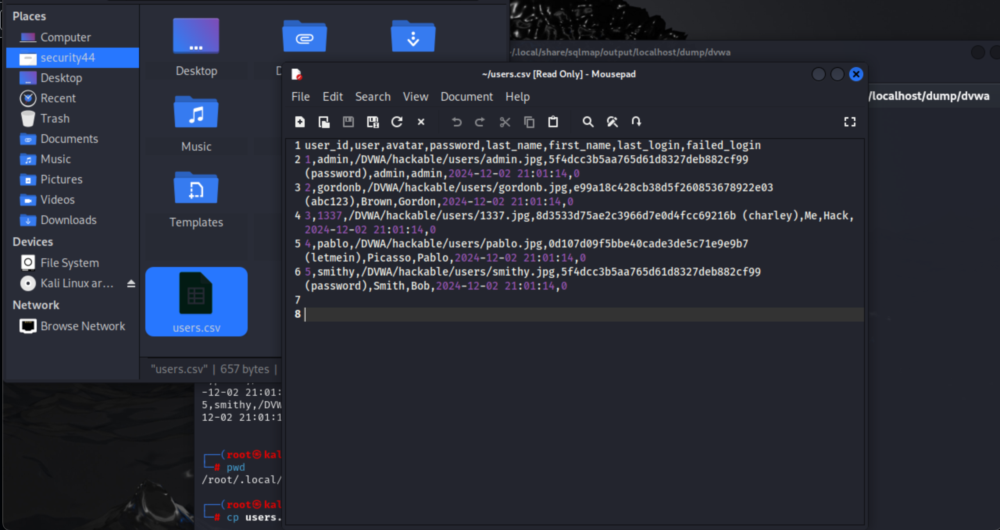

# **Explotación de Vulnerabilidad de Inyección SQL (SQLi) en DVWA**

Este proyecto muestra cómo explotar una vulnerabilidad de inyección SQL (SQLi) en una aplicación web utilizando **sqlmap**. Este proyecto es parte de mi portafolio y tiene como objetivo demostrar mis habilidades en el análisis de vulnerabilidades y explotación de sistemas en el contexto de la **ciberseguridad**.

## **Objetivos del Proyecto** 🎯

1. Configurar y desplegar DVWA en un entorno local.
2. Explorar y entender la vulnerabilidad de inyección SQL (SQLi) en la aplicación.
3. Explotar la vulnerabilidad utilizando **sqlmap** para obtener datos sensibles de la base de datos.
4. Documentar el proceso de explotación, los hallazgos y las técnicas utilizadas.
5. Proponer medidas para mitigar la vulnerabilidad de inyección SQL.

---

## **Tecnologías Utilizadas** 🔧

- **DVWA**: Aplicación web vulnerable utilizada para pruebas de seguridad.
- **sqlmap**: Herramienta de automatización para la explotación de inyecciones SQL.
- **Kali Linux**: Sistema operativo utilizado para realizar las pruebas de penetración.
- **Apache** y **PHP**: Servidor web y lenguaje de programación utilizados en el entorno de DVWA.
- **MySQL**: Base de datos utilizada en el entorno vulnerable.

---

## **Pasos Realizados** 📝

### 1. **Despliegue de DVWA**  
   - Instalar DVWA en un servidor local utilizando Apache y MySQL en Kali Linux.
   - Configurar la base de datos y cambiar la configuración de seguridad a "Low" para habilitar la vulnerabilidad de inyección SQL.

### 2. **Exploración de la Vulnerabilidad SQLi**  
   - Utilicé un parámetro GET vulnerable (`id=1`) en la URL de DVWA para probar si el parámetro estaba siendo inyectado a la base de datos de forma insegura.
   - Confirmé la vulnerabilidad utilizando sqlmap y accedí a la base de datos.

### 3. **Explotación con sqlmap**  
   - Ejecuté el siguiente comando para probar la vulnerabilidad de SQLi y obtener datos sensibles de la base de datos:
     ```bash
     sqlmap -u "http://localhost/dvwa/vulnerabilities/sqli/?id=1&Submit=Submit#" --cookie="security=low; PHPSESSID=5qrh4q5nsdi5vbjfnsnihvao0t"
     ```
   - Utilicé **sqlmap** para obtener datos de la base de datos, como las credenciales de los usuarios de la aplicación.

### 4. **Extracción de Datos**  
   - Extraje las credenciales de los usuarios y los almacené en un archivo de salida.
   - Realicé una revisión de los datos obtenidos para evaluar la gravedad de la vulnerabilidad.

### 5. **Mitigación de la Vulnerabilidad**  
   - Propondría implementar consultas preparadas (prepared statements) y otras medidas para proteger la aplicación contra inyecciones SQL.

---

## **Hallazgos y Resultados** 📊

Durante las pruebas, se identificó que el parámetro `id` de la URL es vulnerable a inyecciones SQL. Al explotar esta vulnerabilidad, se pudieron obtener datos sensibles como las credenciales de los usuarios.

### **Hallazgos Principales**:
- **Base de datos comprometida**: Acceso completo a la base de datos MySQL a través de la inyección SQL.
- **Datos sensibles**: Extracción de contraseñas y nombres de usuario de la base de datos.

| Métrica            | Resultado                  |
|--------------------|----------------------------|
| **Base de datos**  | MySQL                      |
| **Tabla obtenida** | users                      |
| **Campos expuestos** | username, password        |

---

## **Capturas de Pantalla** 📷

A continuación, se muestran algunas capturas de pantalla del proceso:

1. **Resultado de la Inyección SQL con sqlmap**:

   

2. **Datos Expuestos de la Base de Datos**:

   

---

## **Recomendaciones de Mitigación** ⚙️

Para mitigar la vulnerabilidad de inyección SQL en la aplicación, se recomiendan las siguientes medidas:

1. **Usar Consultas Preparadas (Prepared Statements)**:
   - Las consultas preparadas protegen contra inyecciones SQL al separar los datos de la consulta SQL.
   
   Ejemplo en PHP:
   ```php
   $stmt = $pdo->prepare("SELECT * FROM users WHERE id = :id");
   $stmt->execute(['id' => $id]);
2. **Validación de Entrada:**
    - Validar que las entradas de los usuarios sean del tipo esperado (por ejemplo, numéricas en el caso del parámetro id).

3. **Principio de Menor Privilegio:**
    - Asignar los permisos mínimos necesarios para la cuenta de la base de datos utilizada por la aplicación.

4. **Uso de un WAF (Firewall de Aplicaciones Web):**
    - Utilizar un firewall para bloquear patrones comunes de inyección SQL.
      
---
## **Próximos Pasos** 🚀
1. Realizar Pruebas Adicionales:
   - Probar la aplicación con diferentes niveles de seguridad para encontrar otras vulnerabilidades.

2. **Escalación de Privilegios:**
   - Explorar cómo escalar privilegios y acceder a más datos de la aplicación o incluso ejecutar comandos del sistema.

3. **Desplegar en un Entorno de Producción:** 
   - Probar el proyecto en un entorno de producción para verificar la efectividad de las medidas de mitigación.
  
## Autor 👨‍💻

**[Jorge Balarezo Cardenas]**  
- LinkedIn: [Enlace a mi perfil](https://www.linkedin.com/in/jorge-balarezo-cardenas/)  
- Email: [jbalarezocarden@gmail.com]

---

## Licencia 📜
Este proyecto está bajo la Licencia MIT. Para más detalles, revisa el archivo [LICENSE](LICENSE).
